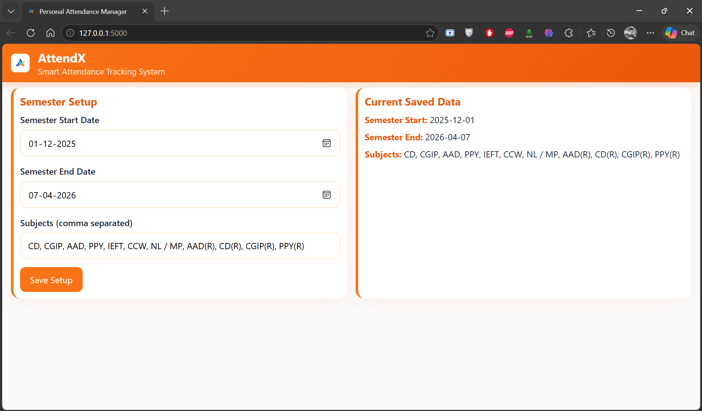
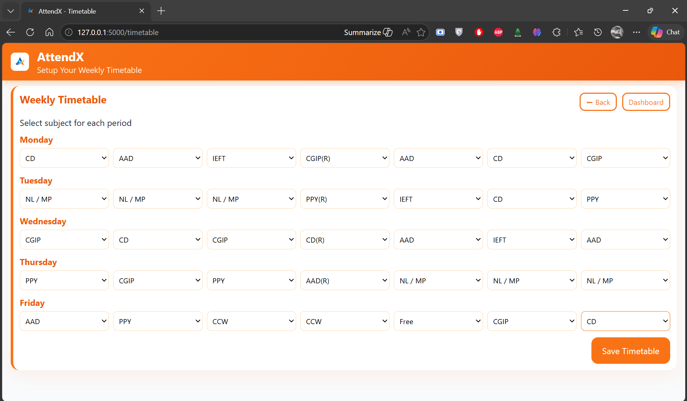
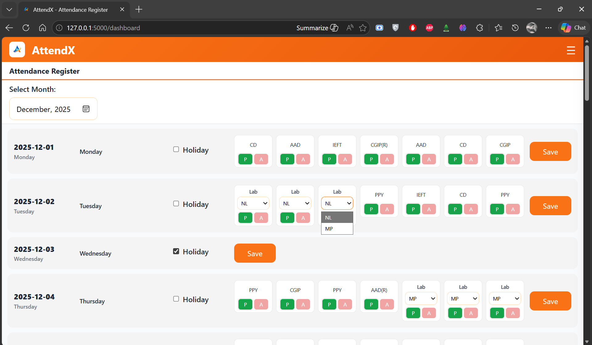
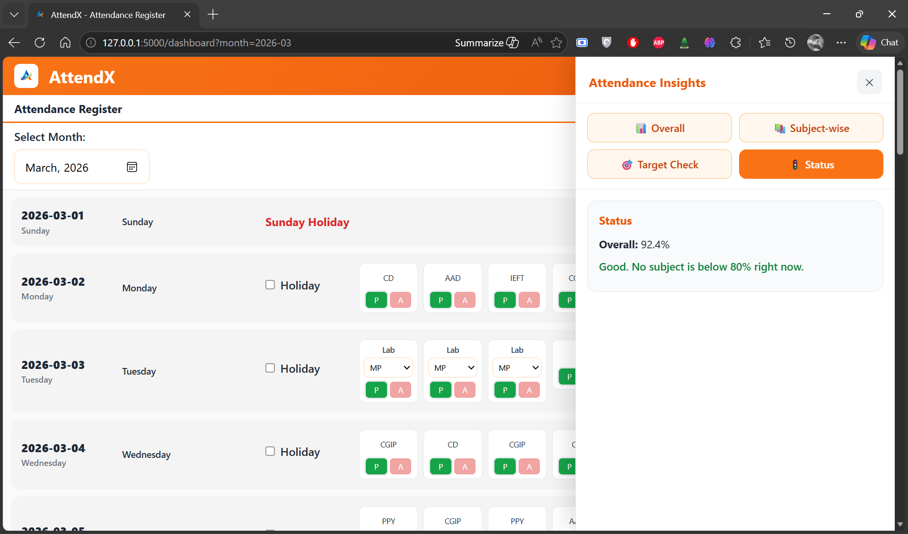
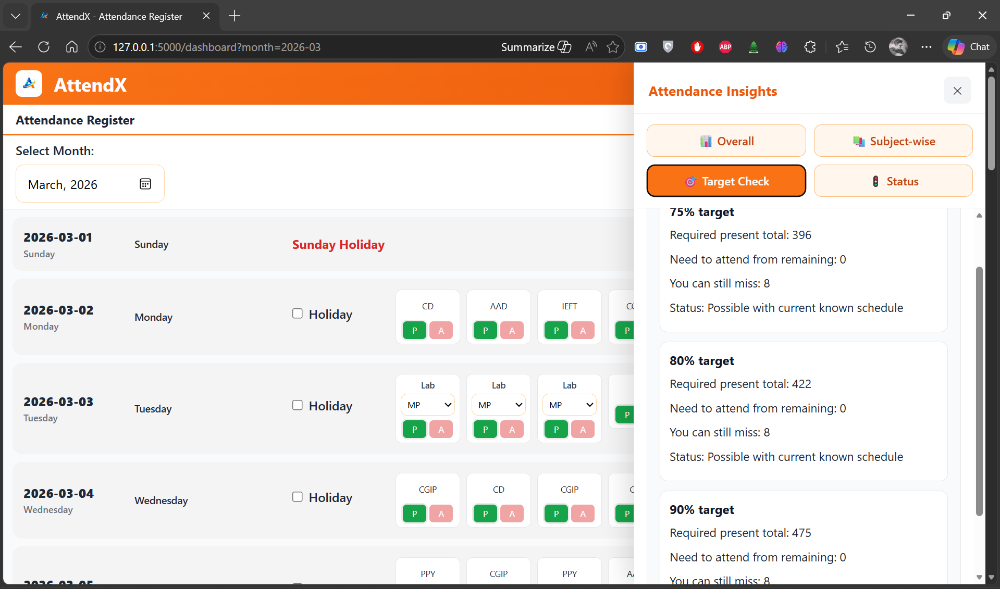
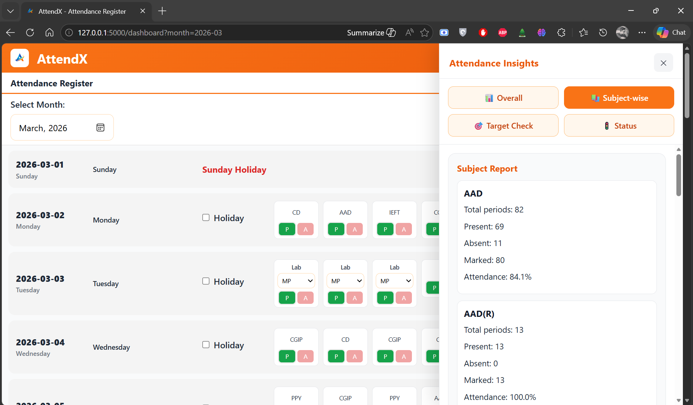
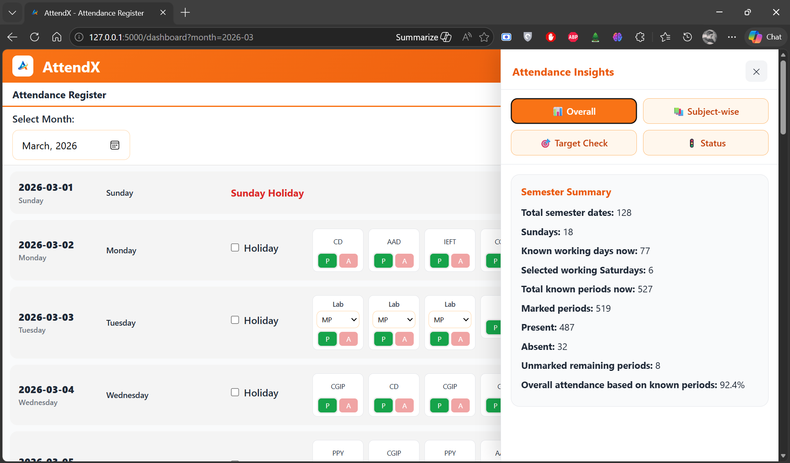
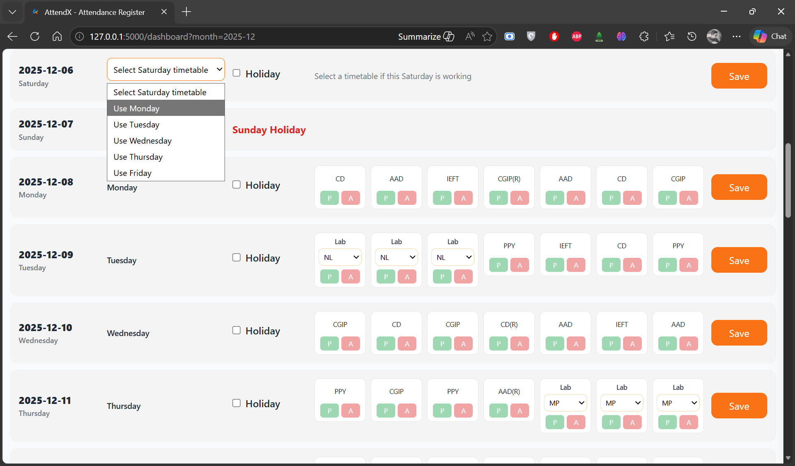

# AttendX – Smart Attendance Tracking System

A structured attendance management system designed to track, analyze, and plan attendance at a **period level**, helping students maintain required academic percentages efficiently.


# Key Features
## Semester Setup
- Define semester start and end dates  
- Add subjects dynamically  
- Stores configuration for long-term tracking  




## Weekly Timetable Configuration
- Assign subjects for each day and period  
- Flexible timetable system  
- Supports real academic structures  



## Daily Attendance Register
- Mark attendance for each period (Present / Absent)  
- Subject-level tracking per day  
- Holiday toggle support  
- Lab handling with subject selection (NL / MP)



## Smart Attendance Insights
### Overall & Status
- Real-time attendance percentage  
- Quick status evaluation  



### Target-Based Planning
- Tracks progress towards:
  - 75%
  - 80%
  - 90%  
- Calculates:
  - Required attendance  
  - Allowed absences  



### Subject-wise Analysis
- Individual subject tracking  
- Detailed attendance breakdown  



### Semester Summary
- Total working days  
- Total periods  
- Attendance statistics  



## Special Features
### Saturday Handling
- Allows mapping Saturday to any weekday timetable  
- Handles irregular schedules dynamically  



# Tech Stack
- **Frontend:** HTML, CSS, JavaScript  
- **Backend:** Python (Flask)  
- **Data Storage:** JSON  

# How to Run
```bash
pip install flask
python app.py
```
Open in browser:
```
http://127.0.0.1:5000
```

# Why I Built This
During my early college semesters, managing attendance became difficult due to increased involvement in activities and events.
Instead of tracking attendance manually, I needed a system that could:
- Show exact attendance at a **period level**
- Help me understand how many classes I could safely miss  
- Ensure I don’t fall below required thresholds (like 75%)
This project was built to solve that problem in a practical and structured way.

# Note
The logo used in this project is personal and should not be reused. 
